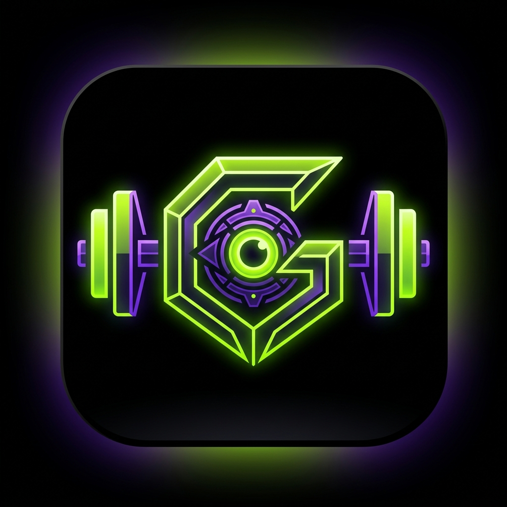

<div align="center">
  
  <h1>GenSentiel</h1>
  <p><strong>Your Local-First Cybernetic Training Sentinel</strong></p>
</div>

<br />

> **GenSentiel** is an elite, cyberpunk-inspired, local-first fitness tracker built for maximum privacy, speed, and aesthetic pleasure. Forget cloud-lag and generic UI — this is your personal training node.

## 🔥 Key Features

- **🛡️ Local-First Architecture**
  Built on Expo SQLite with Write-Ahead Logging (WAL). All your workouts, biometrics, and telemetry are stored securely on your device. Zero loading screens. Zero cloud dependencies.
- **🧠 Intelligent Progression Engine**
  The system analyzes your workout history and automatically suggests logical progressions (e.g., *Push-ups ➔ Diamond Push-ups*) based on volume and performance.
- **⚡ Dynamic Program Generator**
  Tell the app what equipment you own, and it procedurally generates a customized workout split targeting the right muscle groups at your difficulty level.
- **🎨 "Cybernetic Kinetic" Design System**
  Pure OLED blacks, neon lime (`#abd600`), and deep violet (`#8A2BE2`) accents. Enhanced with glassmorphism panels, glowing SVG rings, and haptic feedback.
- **🍏 Nutrition & Macro Telemetry**
  Track your daily fuel with beautifully animated, reactive SVG `MacroRings` that fill up as you log your meals.
- **📸 Progress Vault**
  Locally encrypted directory for your progress photos, utilizing the device FileSystem.

## 🛠 Tech Stack

- **Framework:** [React Native](https://reactnative.dev/) / [Expo](https://expo.dev/) (File-based Routing)
- **State Management:** [Zustand](https://github.com/pmndrs/zustand)
- **Database:** `expo-sqlite`
- **Animations:** `react-native-reanimated` & `react-native-svg`
- **Icons:** `lucide-react-native`
- **Hardware Integrations:** `expo-haptics`, `expo-image-picker`, `expo-file-system`

## 🚀 Getting Started

### 1. Clone the node
```bash
git clone https://github.com/VItaly0117/GenSentiel.git
cd GenSentiel
```

### 2. Install dependencies
```bash
npm install
```

### 3. Boot the system
```bash
npx expo start
```
*Scan the QR code with the Expo Go app on your phone to launch.*

## ☁️ Cloud Sync (Phase 6 Integration)
While GenSentiel is strictly **Local-First**, it is architecturally prepared for offline-first cloud synchronization via **PowerSync** and **Supabase**. 

To enable telemetry sync:
1. Setup a Supabase Postgres instance.
2. Apply the provided DDL schema (with RLS enabled).
3. Connect a PowerSync instance to stream SQLite deltas.
4. Unlock the "Cloud Sync" module in the Operator Settings.

---
<div align="center">
  <i>Stay sharp. Stay consistent. The Sentinel is watching.</i>
</div>
